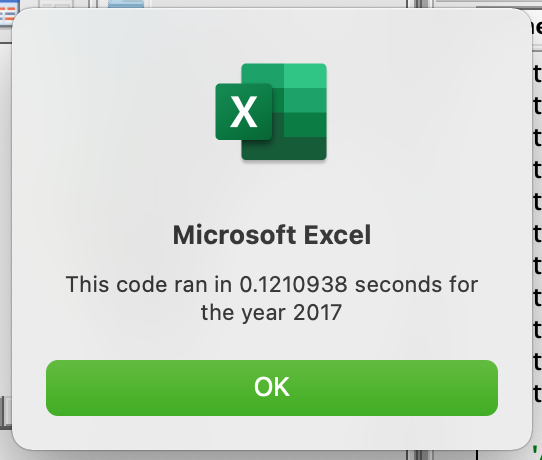
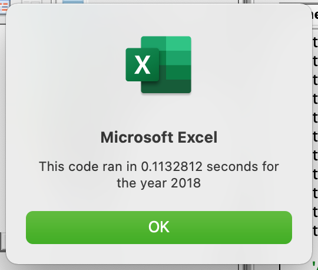
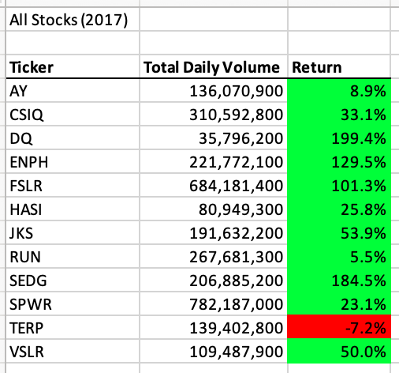
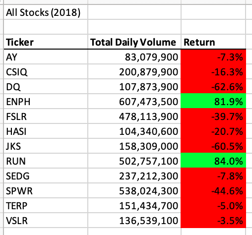

# stock-analysis

## Overview
Steve asked us to assist him in his stock analysis. After preparing a workbook for him, he would like to expand the data set to include the entire stock market over the last few years.

## Results

We can see that our new code is able to run through all of the data in about 0.1 second. Much quicker than our original script we created in our module. 

###### Run Time for 2017

###### Run Time for 2018

We can confirm that based on the data provided, most stocks decreased between 2017 and 2018 in return. Only ENPH and RUN increased in the year 2018 (both over 80%).

###### Results for 2017 Stocks

###### Results for 2018 Stocks

## Summary
